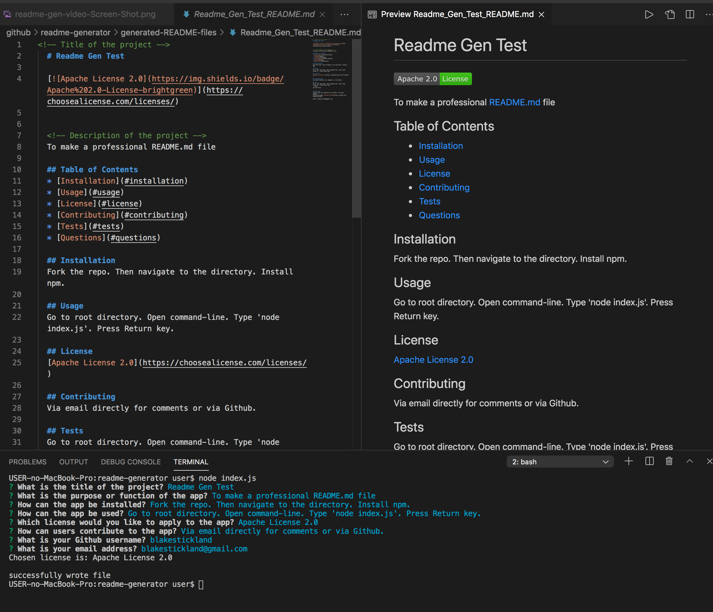
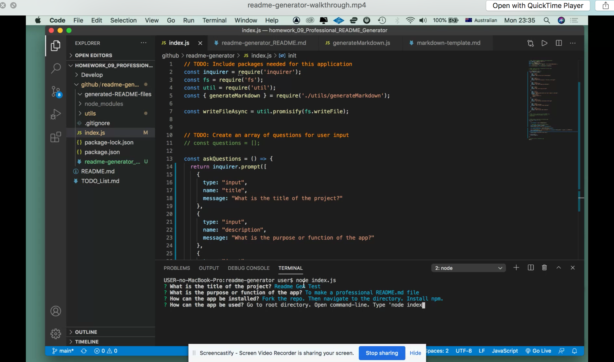

<!-- Title of the project -->
  # readme-generator 

  [](https://choosealicense.com/licenses/)
  

  <!-- Description of the project -->
  A command-line application to quickly and easily generate README.md files with the results from a user's input. Uses the Inquirer package and does a basic layout of the markdown.
  
  ## Table of Contents
  * [Installation](#installation)
  * [Usage](#usage)
  * [License](#license)
  * [Contributing](#contributing)
  * [Tests](#tests)
  * [Questions](#questions)
  
  ## Screenshot

  

  ## Installation
  1. Fork the readme-generator repository to your local drive.
  2. Open the command-line. 
  3. Navigate to the root folder of the readme-generator (containing the index.js file).
  4. Install npm to get the package Inquirer.
  ``` bash
  npm install
  ``` 

  ## Usage
  1. Open the command-line. 
  2. Navigate to the root folder of the readme-generator (containing the index.js file).
  3. Run the app by using the following command:
  ```bash
  node index.js
  ```

  ## Walk-through Video
  [](assets/walkthrough-video/readme-generator-walkthrough.mp4)

  
  ## License
  [MIT License](https://choosealicense.com/licenses/)
  
  ## Contributing
  If you would like to contribute, please fork the app, develop, and submit ideas via pull requests. Direct contact any suggestions too via GitHub or email.


  ## Questions
  Github username: blakestickland

  Email: blakestickland@gmail.com